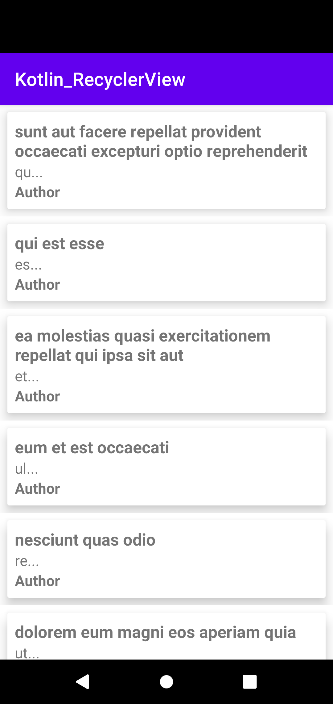

# RecyclerView to pass Item ClickListner To Fragment with passing parameters

In this android app API's data is received using Retrofit with complete MVVM architect and showed in recycleview
also item clickListner is used to send the clicklistner of adapter to the fragment.

## Technologies
* MVVM
* LiveData, Lifecycle Observer
* Retrofit
* ViewModel
* ViewModelFactory
* Fragment

## Dependencies

**def retrofit_version = "2.9.0"**

    implementation "com.squareup.retrofit2:retrofit:$retrofit_version"
    implementation "com.squareup.retrofit2:converter-gson:$retrofit_version"
    
**def lifecycle_version = "2.2.0"**

    implementation "androidx.lifecycle:lifecycle-viewmodel-ktx:$lifecycle_version"
    implementation "androidx.lifecycle:lifecycle-livedata-ktx:$lifecycle_version"
    implementation 'androidx.lifecycle:lifecycle-extensions:2.2.0'
    

## Screenshot


```kotlin
adapter.onItemClick = { contact, status ->
        // do something with your item
        Log.d("TAG", contact.email)
    }
  
    
 

